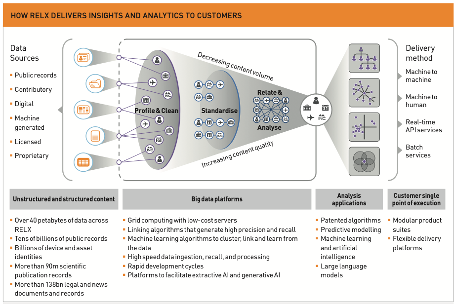

# RELX: Helping customers make better decisions, get better results and be more productive

## Overview and Origin 📜

### Name of company

 [RELX](https://www.relx.com/) (NYSE: [RELX](https://www.relx.com/investors/share-price/nyse))

### When was RELX incorporated?

 [RELX](https://www.relx.com/) was founded as the RELX Group in 1993 through a merger of Reed International and Elsevier NV and then rebranded as RELX in 2015. It is incorporated in the UK (London) even though Elsevier is headquarted in Amsterdam. It is an international organization (36,000 employees who serve customers in over 180 countries), with key offices in cities beyond London and Amsterdam:

 * New York City, USA: A primary office for LexisNexis (RELX’s legal information and analytics division) and a critical hub for its North American business operations.

 * Dayton, Ohio, USA: Another key location for LexisNexis, focused on its operational infrastructure and support functions.

 * Chennai, India: RELX’s technology and publishing back-office operations, particularly for Elsevier and LexisNexis, are concentrated here, reflecting a strong reliance on India's technical and editorial talent.

 * Beijing and Shanghai, China: Offices to support its growing market presence in Asia, primarily in the scientific and STM publishing sectors through Elsevier.

 * Singapore: Regional hub for Southeast Asia, supporting business development, operations, and customer engagement.

### Who is the CEO?

 [Erik Engström](https://www.relx.com/investors/corporate-governance/board-of-directors) has been CEO since 2009.

### How did the idea for RELX come about?

 RELX was formed to combine Reed International and Elsevier NV's complementary strengths in general publishing, business information, and scientific, technical, and medical (STM) content. The merger aimed to expand market reach, invest in digital technologies, and create a more resilient and diversified global organization. Today, RELX is the [UK's fifth most valuable company](https://www.relx.com/~/media/Files/R/RELX-Group/Media%20folder/jan25-ft.pdf), just above BP.

### How is RELX funded? How much funding have they received?

 RELX ([NYSE: RELX](https://www.relx.com/investors/share-price/nyse)) is a publicly traded company. It is listed on multiple stock exchanges: the London Stock Exchange (LSE), the Amsterdam Exchange (Euronext Amsterdam), and the New York Stock Exchange (NYSE). It has a market cap of over [$88 billion](https://www.relx.com/our-business/our-business-overview).

## Business Activities 🏃‍♀️🏃‍♀️

### What specific problem is RELX trying to solve?

 RELX seeks to help its cusomters "make better decisions, get better results and be more productive." Toward that, it carries out activities such as:

 * <b>Advancing Scientific and Medical Knowledge:</b> Publishing leading peer-reviewed journals (e.g., The Lancet and Cell) and provides platforms like Scopus for efficiently and reliably delivering research and citation tracking (Elsevier division)

 * <b>Overcoming Information Overload in Specialized Fields:</b> Providing advanced data analytics tools and platforms, such as ScienceDirect for research, to help customers handle vast quantities of data for more effective decision-making.

 * <b>Improving Decision-Making Across Industries:</b> Providing real-time analytics and expert-curated information, enabling informed, evidence-based decision-making to professionals in law, medicine, and business

 * <b>Supporting Education and Skill Development:</b> Supporting lifelong learning in specialized fields through academic content, online courses, and certification tools that help professionals and organizations grow.

 * <b>Additional Areas:</b> RELX also supports customers by Enhancing Risk and Fraud Prevention and Enhancing Legal and Regulatory Efficiency. These are areas in which I do not have any experience.

### Who is RELX's intended customer? Is there any information about the market size of this set of customers?

 RELX's Scientific, Technical & Medical sector seemingly aligns best with my experience and interests. For example, the [Scopus AI team](https://stories.relx.com/scopus-ai-team/index.html) interestingly pulled together a multi-disciplinary team to develop an advanced research platform with [summarization and collaboration features](https://www.elsevier.com/en-gb/products/scopus/scopus-ai). The sector experienced around 4% growth in the [first half of 2024](https://www.thetimes.com/business-money/technology/article/comic-con-festival-ai-drive-boom-relx-sales-jtncr66w0?utm_source=chatgpt.com&region=global). Its customers fall into three areas:
 
 * Academic and Research Institutions: Universities and research centers worldwide rely on Elsevier's platforms like ScienceDirect and Scopus for access to scientific literature and research analytics.

 * Healthcare Organizations: Hospitals and medical institutions use Elsevier's ClinicalKey and ClinicalPath for evidence-based clinical information and decision support.

 * Educational Institutions: Schools and universities adopt RELX's educational resources for curriculum development and student learning.

 Additional RELX products and services fit within three sectors: Risk, Legal and Exhibitions:

 * Legal Firms and Departments: Law firms and corporate legal departments utilize LexisNexis for comprehensive legal research and analytics.

 * Financial Institutions: Banks and insurance companies employ LexisNexis Risk Solutions for identity verification and fraud prevention.

 * Government Agencies: Various governmental bodies use RELX's data analytics tools for regulatory compliance and risk management.

 * Corporations: Businesses across industries leverage RELX's analytics for market research and strategic decision-making.

 * Publishing Houses: Publishers access RELX's databases for content and citation information.

 * Legal and Regulatory Bodies: Regulatory agencies utilize RELX's tools for legal information and compliance monitoring.

 * Aviation Industry: Airlines and aerospace companies use Cirium's data and analytics for operational efficiency.
 
* What solution does this company offer that their competitors do not or cannot offer? (What is the unfair advantage they utilize?)

 The vast availability of resources and expertise appear to set RELX apart from competitors. Here is a 2023 high-level graphic of its infrastructure and data pipeline: 

 

## Landscape ⛰️

### What are the major companies in this field?

 * [Springer Nature:](https://group.springernature.com/gp/group) A major competitor in academic publishing, offering journals and platforms like Nature and SpringerLink.

 * [Wiley (John Wiley & Sons):](https://www.wiley.com/en-us) Competes in publishing scholarly journals and educational materials.
 
 * [Taylor & Francis (Informa)](https://www.informa.com/divisions/taylor-and-francis/): Known for its academic journals and research-focused publications, it recently partnered with DataSeer (described above) in a [data sharing agreement and pilot](https://dataseer.ai/2024/10/14/taylor-francis-and-dataseer-to-collaborate-in-data-sharing-compliance-checks-and-open-science-metrics-pilots/).

### What have been the major trends and innovations of this field over the last 5&ndash;10 years?

 Open Science is a field that has grown over the last 10 years due to interlocking factors including: [federal](https://www.whitehouse.gov/ostp/news-updates/2022/08/25/breakthroughs-for-alldelivering-equitable-access-to-americas-research/) to [global](https://doi.org/10.54677/MNMH8546) policy initiatives aimed at democratizing access to research knowledge and data; pushback to [peristent price increases for research journals](https://library.missouri.edu/news/lottes-health-sciences-library/scholarly-publishing-and-the-health-sciences-library#:~:text=The%20health%20sciences%20have%20been,of%20Missouri%20system%20pays%20now.&text=Why%20are%20journal%20prices%20increasing,bring%20journal%20prices%20under%20control.); and industry recognition that [Open Science may be good for business](https://www.weforum.org/stories/2023/11/open-science-6-reasons-businesses-should-pay-attention/). Yet less is known as to the size and scope of growth for aspects of Open Science, RDM, or Scholarly Communication.

 There is a growing trend to use AI for a variety of scientific publication-related products and services, examples outsdie of RELX or [Elsevier](https://www.elsevier.com/about/policies-and-standards/publishing-ethics-books/the-use-of-generative-ai-and-ai-assisted-technologies-in-the-editing-process) include:
 
 * [DataSeer](https://dataseer.ai/) is a small AI and Research Data Services company addressing multiple research industry inefficiencies that are related to policy, infrastucture, and workflows. Arguably, inefficiencies in science render a vast majority of medical research to have, ["limited or no value to the end user."](https://www.nature.com/articles/s41559-024-02433-5) DataSeer employs ML and NLP in various ways to address these and makes some of their work [publicly available Github](https://github.com/DataSeer), .
 
 * [SciCrunch](https://www.scicrunch.com/) produces [SciScore](https://sciscore.com/). SciScore provides a Rigor & Transparency Index (RTI) with which users can generate reports on research articles' rigor and transparency.

 * [Kopernio](https://ir.clarivate.com/news-events/press-releases/news-details/2018/Clarivate-Analytics-Acquires-Research-Startup-Kopernio-to-Accelerate-Pace-of-Scientific-Innovation/default.aspx) (acquired by Clarivate, 2018): AI that enables 1-click access to scholarly journals within institutional (academic) paywalls/firewalls as well as publicly available research.

 * [iNLP by integra](https://integranxt.com/inlp-ai-language-assessment/): AI/NLP for reducing the time and effort for editing scholarly journal articles.
 
 * [editage by Cactus](https://www.editage.com/): AI writing and editing assistants primarily directed at researchers/authors to optimize writing for paper pre-submission and post-submission.

## Results 📈

### What has been the business impact of RELX so far?

 RELX consistently reports billions of dollars in annual revenue and its global operations support customers in over 180 countries.

### What are some of the core metrics that companies in this field use to measure success? How is RELX performing based on these metrics?

RELX tracks key performance indicators (KPIs) track progress against long-term priorities at multiple levels: group, market, and product. Notably, KPIs pertain to corporate responsibility such as tracking the percentage of women managers, "socially responsible suppliers," and emissions.

### How is RELX performing relative to competitors in the same field?

According to its 2023 Annual Report, RELX's market positions are either first or second in each of its four market segments:

* Risk: #1 market position 🏆

* Scientific, Technical & Medical: #1 global market position 🏆

* Legal: # 1 market position outside the US, #2 in the US 🏆

* Exhibitions: #2 global market position 🏆

## Questions and Interests ☝🏽

### Questions

* How closely does RELX work with Elsevier's [Digital Commons](https://www.elsevier.com/products/digital-commons)? What's the relationship? Are there ongoing joint efforts between the two?

* Scopus AI is an exciting way to leverage technology that promotes research efficiencies and researcher engagement. What related activities are underway, and anything on the horizon you may share?

* Does RELX, Digital Commons, and/or other groups at Elsevier have efforts underway (or interest) in the intersections between research publications, knowledge dissemination, and AI to enable learning health systems?

### Suggested ideas for RELX products or services

* Build upon RELX's ecosystem to instantiate a scientific publication marketplace that rewards researchers for engagement (e.g., article reviews, data sharing, etc.) along the lines of DeSci efforts like [ResearchHub](https://www.researchhub.com/)

* Use unsupervised AI to suggest reseach gaps that one or more journals could address via special issues and/or calls for publication.

* Use unsupervised AI to develop new ways of measuring research impact, such as by analyzing journal/publication metadata along with social media data.

### Why would offering the products or services benefit RELX?

* A RELX-centered research marketplace could promote its own publications and greater engagement with scientists/customers

* Use unsupervised AI to suggest reseach gaps that one or more journals could address via special issues and/or calls for publication.

* AI could identify missing, new, or understudied subject areas based on published articles (or not) and make suggestions that help editors plan for future publications that address important, but underaddressed, areas of study and better engage existing or new audiences.

* Use unsupervised AI to develop new ways of measuring research impact, such as by analyzing journal/publication metadata along with social media data.

* AI could drive a fuller yet more nuanced view about the influcences particular research may be having among more varied audiences. This in turn could inform journals about audience engagement or development strategies, as well as help authors by more accurately determining the impact of their work.